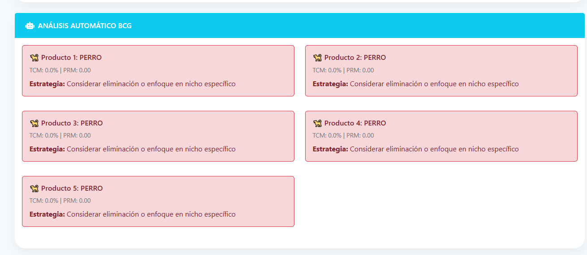
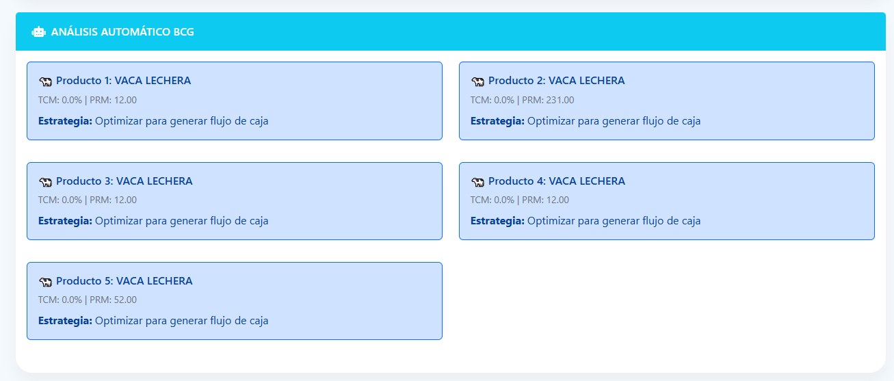

# Examen Práctica Unidad II - PETI

**Alumno:** Abraham Jesús Vela Vargas  
**Fecha:** 28/05/2025  
**Repositorio:** [https://github.com/Vela2001/PE_II_EXAMEN_PRACTICO.git](https://github.com/Vela2001/PE_II_EXAMEN_PRACTICO.git)

---

## Mejoras Implementadas

### 1. Análisis Automático BCG

  

**Descripción:**  
Se desarrolló un módulo de clasificación automática de productos basado en la Matriz BCG que categoriza cada producto en una de las cuatro cuadrantes: Estrella, Vaca, Interrogante y Perro. Esto permite una visualización clara y rápida del posicionamiento estratégico de cada producto.

**Características:**  
- Clasificación automática y dinámica basada en los datos de ventas y participación de mercado.  
- Recomendaciones estratégicas específicas para cada categoría, facilitando la toma de decisiones.  
- Actualización en tiempo real, de modo que los cambios en los datos se reflejan instantáneamente en el análisis.

---

### 2. Validación y Guardado Inteligente

  

**Descripción:**  
Se implementó un sistema robusto de validación que verifica automáticamente la integridad y completitud de los datos antes de ser guardados.

**Características:**  
- Validación automática con detección de campos faltantes o datos erróneos.  
- Alertas visuales y mensajes claros para guiar al usuario en la corrección de errores.  
- Proceso de guardado seguro que confirma el éxito o informa problemas, mejorando la experiencia del usuario.

---

### 3. Implementación Rápida y Modular

**Pasos para integrar las mejoras:**  
- Copiar el código JavaScript del módulo de análisis automático.  
- Agregar la sección HTML correspondiente para el análisis automático dentro de la interfaz.  
- Actualizar el evento del botón de guardar para incluir la validación previa y el guardado inteligente.  

Este enfoque modular facilita la integración y mantenimiento del código.

---

## Consideraciones Finales

Estas mejoras potencian significativamente la funcionalidad del sistema PETI, aportando automatización, seguridad y usabilidad para los usuarios encargados del análisis estratégico. La implementación responde a las necesidades prácticas de un entorno dinámico y requiere interacción confiable con la base de datos.
